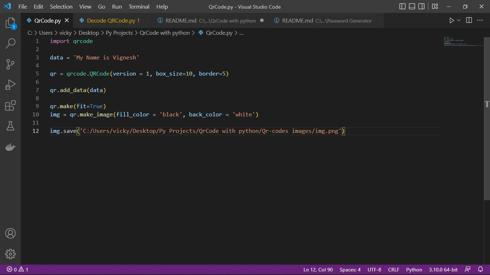
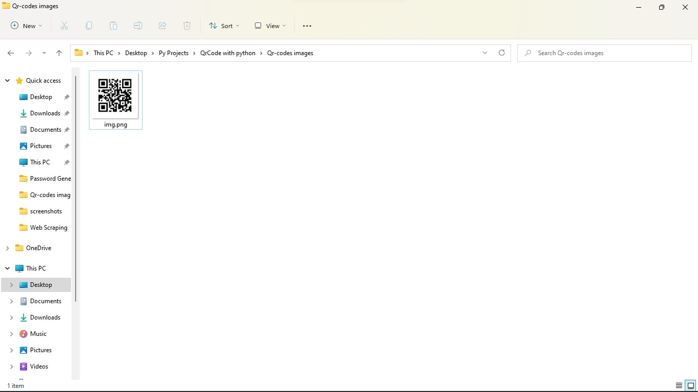
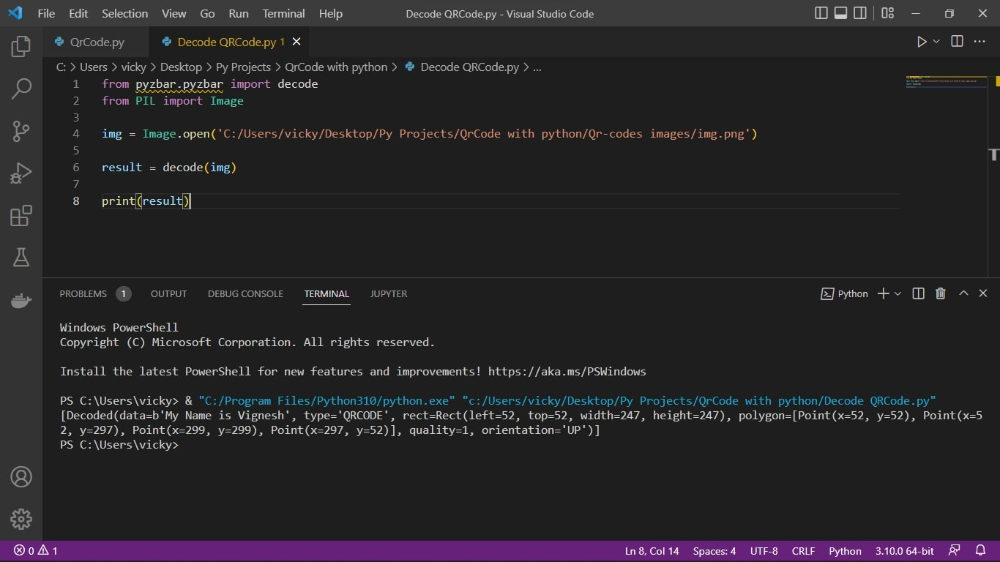

## QR-Code Generator

## Create File
```
Create File to Save the Generated QR-Code images.and that File location path will be copied. 
```
## Modify
```
Open the QrCode.py file Any TextEditor eg,VScode,Atom..

To Modify 12th Line of the code.To paste the File location path.and change the symbol '\' to '/' and put image name as well.  Eg,..('C:/Users/vicky/Desktop/Py Projects/QrCode with python/Qr-codes images/img.png')
```
Demo image<br>

<br><br>

## Run
```
To run the QrCode.py file.

QR-Code Will be saved that particular Path and Check it.
```
Eg image<br>

<br><br>

## Decode QR-Code

This is Decode the QR-Code

## Run
```
Run the Decode QRCode.py File.
```
## Output
```
In the 4th line of the code Put  the image location path.
```
Output image<br>

<br><br>
